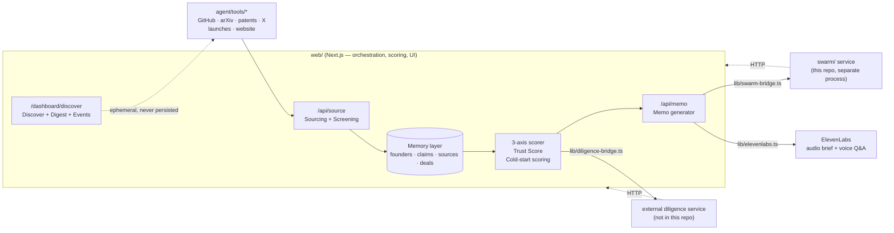
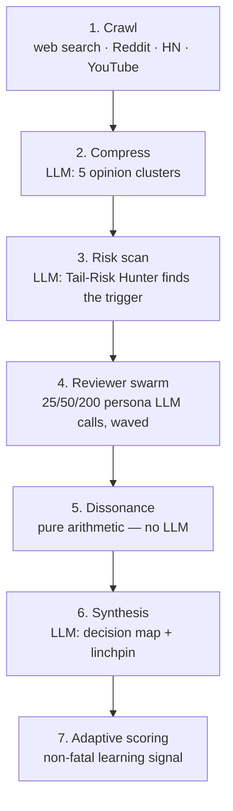

# The VC Brain

Sourcing → Screening → Diligence → Decision. A data- and AI-first system that
takes a human investor from first signal on a founder to a confident $100K
check decision within 24 hours.

Out of scope by design: portfolio monitoring, follow-on, fund ops, exit.

## Why this exists

Most founder-screening tools either fabricate confidence they don't have or
quietly penalize founders with no funding history and no network — the two
things a pre-seed / first-check investor should care about least. This
project is built around three deliberate constraints instead:

- **Cold-start scoring is a first-class path, not an afterthought.** A
  founder with zero identity signal (no funding, no follower count, no
  pedigree) is scored on process — shipping cadence, completion rate,
  response to public critique, technical writing depth — with an honestly
  wide confidence interval, never a flat penalty for thin data.
- **Scores never collapse into one number.** Founder / Market /
  Idea-vs-Market ship as three independent, unaveraged axes, each with its
  own interval and trend. A single blended score hides exactly the
  disagreement an investor needs to see.
- **Every claim traces to a source, and every score ships its own
  uncertainty.** Trust Score is per-claim (data volume × cleanliness ×
  signal agreement), not per-company. Missing data is flagged explicitly
  ("Cap table: not disclosed") — never fabricated.

## Structure

```
web/         Next.js 15 / React 19 app — orchestration, scoring, Memory layer, UI
diligence/   Contract docs for an external diligence service (no third-party code)
swarm/       Standalone Flask + Ollama service — adversarial multi-agent simulation
docs/        Architecture notes
```

`web/` is a self-contained application with no embedded third-party source.
It optionally calls two separate services over plain HTTP, each started
independently: a diligence service for document-analysis capabilities
(knowledge graph, red-flag scan, absence detection, dealbreaker scan — see
`diligence/README.md`) and the `swarm/` simulation service in this repo (see
`swarm/README.md`). Everything works fully offline in mock mode with zero
external dependencies, including both of those.

## Architecture at a glance





## External tools and services, and why

| Tool / service | Used for | Why this one |
|---|---|---|
| **GitHub REST + search API** | Founder activity signal; `Discover`'s candidate search | Free, no auth needed for search; the only public API that directly answers "does this person actually ship code" |
| **arXiv API** | Founder publication signal; `Discover`'s researcher search | Free, no key, canonical source for CS/ML papers — live-verified against real queries before coding against it |
| **Devpost public search** | Founder-events discovery (`lib/events.ts`) | Only major hackathon/pitch-day aggregator with an accessible unauthenticated search endpoint |
| **PatentsView API** | Patent signal (`agent/tools/patents.ts`) | Official USPTO-backed patent search API; key-gated, guarded to skip cleanly without one |
| **X (Twitter) API v2** | Public shipping-post / critique-response signal | Official API, Bearer-token auth; deliberately reads for shipping cadence, not follower counts |
| **Tavily** | Optional live web-pulse search (`lib/tavily`) | Search API built for LLM tool-use — structured, summarized results instead of raw HTML |
| **ElevenLabs** | Audio memo briefs + voice Q&A (`lib/elevenlabs.ts`) | Highest-quality low-latency TTS available as a simple REST call; degrades to text-only with no key |
| **External diligence service** | Document analysis: red-flag score, absence detection, dealbreaker scan | Kept as a separate HTTP service by design — document-analysis is a distinct engineering problem from founder-scoring, and the contract in `diligence/README.md` lets either side evolve independently |
| **`swarm/` (Ollama-backed)** | Adversarial multi-agent scenario simulation | Runs fully local against your own Ollama instance — no per-call API cost for a stage that makes dozens of LLM calls per run (turbo mode alone is ~25); see `swarm/README.md` for the full pipeline |

## Quick start

```bash
cd web
npm install
npm run dev:mock      # deterministic demo mode, zero network calls
# open http://localhost:3000/dashboard
```

To verify the mock path end to end without opening a browser:

```bash
npm run test:mock
```

To point at a live diligence service instead of mock fixtures, unset
`VCBRAIN_MOCK` and set `DILIGENCE_BASE_URL` — see `web/.env.example` and
`diligence/README.md`. To run the swarm simulation live instead of the
built-in mock scenarios, start `swarm/` (see `swarm/README.md`) and set
`SWARM_BASE_URL`.

## Docs

- [`docs/ARCHITECTURE.md`](docs/ARCHITECTURE.md) — request flow, Memory
  layer schema, scoring design
- [`docs/ETHICS.md`](docs/ETHICS.md) — data-minimization policy and where
  each constraint is actually enforced in code
- [`docs/DEMO_SCRIPT.md`](docs/DEMO_SCRIPT.md) — timed walkthrough and full
  narration script for presenting this to a team or judges
- [`diligence/README.md`](diligence/README.md) — the external diligence
  service's expected API contract
- [`swarm/README.md`](swarm/README.md) — the multi-agent simulation
  service's pipeline stages, models, and setup

## Status

Core pipeline (Memory layer, cold-start scoring, 3-axis scorer, Trust Score,
diligence bridge, memo generator, traceability log, mock mode, dashboard) is
built and verified two ways: type-checks clean, builds clean, an integration
self-check (`npm run test:mock`) exercises the full Sourcing → Screening →
Diligence → Decision flow offline — and separately, the sourcing tools and
the diligence bridge have been run live against the real GitHub API and a
live instance of an external diligence backend, end to end
(source → upload → red-flag scan → dealbreaker scan → signal emitted into
that service's own signal log → memo generated). That live pass caught and
fixed two response-shape mismatches in `lib/diligence-bridge.ts` — see its
type comments for what changed.

Sourcing covers GitHub, Hacker News / Product Hunt launches,
website content, X (official API v2, looks specifically for shipping posts
and public critique-response — not follower counts), arXiv papers
(free, live-verified), and patents (PatentsView, key-gated, built to their
documented contract but not live-verified — no key was available during
development). Every optional path is guarded the same way: no key means
that source is skipped, not that anything fails.

Given no GitHub handle at all, Sourcing doesn't just give up — it searches
GitHub itself for a plausible match on the company or founder name
(`agent/tools/github.ts::discoverGithubHandle`) before accepting a true cold
start. Anything built from a discovered-not-provided handle is marked as
such in the claim text and scored at lower confidence than an explicitly
supplied one.

A few modules are intentionally partial and say so in their own header
comment: a live self-validation harness (`web/lib/self-validation.ts`) that
needs real outcome data to be useful, a sourcing-channel prior model
(`web/lib/scoring/channel-priors.ts`) that needs a real historical dataset,
and a self-correction validator (`web/lib/validator-agent.ts`, now actually
wired into every sourced deal) with one real check implemented and one
honestly labeled stub.

**Discover** (`/dashboard/discover`, `lib/discover.ts`) — actively searches
GitHub and arXiv for new candidates matching an industry/geography/university
filter, live-verified during development. Also surfaces founder events
(`lib/events.ts` — hackathons, pitch days, demo days via Devpost's public
search, live-verified) matching the same industry/geography filters, so a
VC can see what's happening in their vertical before any individual founder
gets sourced. Deliberately writes nothing to the Memory layer on its own; a
candidate becomes a real, persisted, scored deal only once a human picks
one and runs it through Sourcing (see `docs/ETHICS.md`).

**Monthly digest** (`/dashboard/digest`, `lib/digest.ts`) — composes a real,
written digest from a live Discover search and renders a copyable preview.
Deliberately does not send anything: no email provider is wired up, and it
never will fire a real send without your explicit go-ahead each time.

**Swarm simulation** (`swarm/`, called via `web/lib/swarm-bridge.ts`) — a
standalone Flask service, run entirely against a local Ollama instance, that
takes a deal's topic through six real stages (crawl public sources, compress
into opinion clusters, scan for the tail-risk trigger, run a 25/50/200-strong
reviewer swarm of biased personas, calculate cognitive dissonance from that
swarm's actual sentiment data, synthesize a decision map) plus a non-fatal
adaptive-scoring stage. Live-tested end to end against a local Ollama
instance (`llama3.2:3b` / `phi4:14b` / `mistral-small:24b`) — turbo mode (25
reviewers) completed in just under 3 minutes and returned a real, non-mocked
scenario map matching `swarm-bridge.ts`'s expected shape exactly, no client
changes required. With `SWARM_BASE_URL` unset, `web/` uses a small
deterministic mock scenario pair instead — see `swarm/README.md`.
