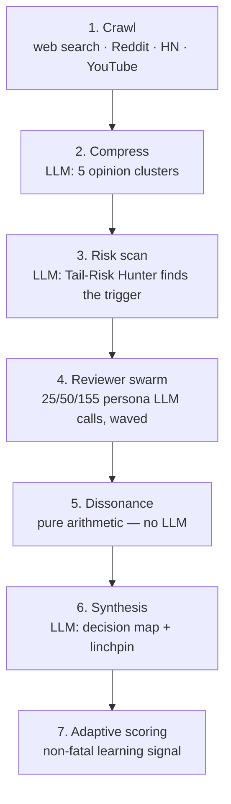

# Viscosity Swarm — adversarial multi-agent simulation service

A standalone Flask service that runs a topic through a multi-stage,
multi-agent simulation against a local Ollama instance and returns a
decision-ready scenario map. `web/` calls it over HTTP through
`web/lib/swarm-bridge.ts` — never embedded, always a separate process you
start yourself, same external-service pattern as `diligence/`.

## What it does

Six real stages, run inline, blocking until the whole thing finishes:



Detailed breakdown:

1. **Crawl** — pulls public signal on the topic from web search, Reddit,
   Hacker News, and YouTube titles. Every source is best-effort; one failing
   doesn't fail the run.
2. **Compress** — one LLM call folds the crawled posts into 5 opinion
   clusters (label, core belief, sentiment, emotion).
3. **Risk scan** — one LLM call (the "Tail-Risk Hunter" persona) looks for
   the low-probability, high-impact trigger the crowd isn't pricing in.
4. **Reviewer swarm** — a wave of small, deliberately biased persona calls
   (bullish / bearish / mixed, see `personas.py`), each reacting to the
   topic in one raw sentence plus a sentiment score. Swarm size is 25
   ("turbo", default), 50 ("standard"), or 200 ("deep") — see timing below.
5. **Dissonance** — pure arithmetic over the swarm's parsed sentiments, no
   LLM call: sentiment extremity ("the trap"), consensus-vs-risk gap ("the
   blindspot"), and sentiment variance ("the chaos"), weighted 0.3/0.4/0.3
   into one composite score.
6. **Synthesis** — one LLM call turns the risk finding, the reviewer census,
   and the (already-computed, non-negotiable) dissonance score into a
   decision map: linchpin, bull case, prediction range, actionable pressure
   points.

A seventh, non-fatal stage (`scoring.py`) records which reviewer personas'
gut reactions lined up with the risk finding, as a lightweight learning
signal per topic domain. It never blocks or fails a run — see the docstring
in `scoring.py` for exactly what it does and doesn't do yet.

## Running it

```bash
cd swarm
pip install -r requirements.txt
cp .env.example .env   # then edit if you're not using localhost defaults
python -m swarm.service   # from the VISCOSITY/ repo root, not swarm/
```

Requires a running Ollama instance (`ollama serve`) with these tags pulled:

```bash
ollama pull llama3.2:3b       # reviewer swarm — small, fast, runs the volume
ollama pull phi4:14b          # risk scan + synthesis — needs more reasoning depth
ollama pull mistral-small:24b # compress stage
```

Swap any of the three via `VISCOSITY_SWARM_MODEL` / `VISCOSITY_RISK_MODEL` /
`VISCOSITY_SYNTHESIS_MODEL` in `.env` if your hardware can't fit the
defaults — a smaller reviewer-swarm model matters most for turbo-mode
latency since it's called once per reviewer.

### Timing by swarm size

| Mode | Reviewers | Typical wall-clock (single consumer GPU) |
|---|---|---|
| Turbo (default) | 25 | ~2 min |
| Standard | 50 | ~5 min |
| Deep | 155 (the full persona bank — see `personas.py`) | ~20 min |

`web/`'s `swarm-bridge.ts` budgets a 240s timeout on the `/api/simulate`
call, which comfortably covers turbo mode — raise it client-side if you plan
to call standard/deep from the app.

## Connecting it to `web/`

Point `SWARM_BASE_URL` (in `web/.env.local`) at wherever this runs — by
default `http://localhost:5100`. `web/lib/swarm-bridge.ts` already POSTs
`{topic, founder, company}` to `${SWARM_BASE_URL}/api/simulate` and expects
back `{status, scenarios[], feed[], activeAgents[]}` — this service was
built to that exact contract, so no changes are needed on the `web/` side.
With `SWARM_BASE_URL` unset (or `VCBRAIN_MOCK=1`), `web/` falls back to a
small deterministic mock scenario set — the rest of the product works fully
without this service running.

## Files

| File | What's in it |
|---|---|
| `pipeline.py` | The six-stage pipeline described above |
| `agents.py` | The fixed "lens" agent roster + keyword-based selection |
| `personas.py` | Reviewer-swarm persona sketches (bullish/bearish/mixed) |
| `scoring.py` | Non-fatal adaptive-scoring learning signal (stage 7) |
| `service.py` | Flask app — `/api/simulate`, `/health`, SQLite schema init |

## What this is, and isn't

This is a genuine multi-stage simulation — every JSON result in the pipeline
is either a real LLM call against your local Ollama instance or a real
arithmetic calculation over that call's output. Nothing is pre-scripted or
faked. The adaptive-scoring stage (7) is explicitly the least mature part:
it records a learning signal but nothing yet feeds it back into how future
reviewer calls are prompted — `scoring.get_reviewer_weight` is exposed for
that but unused by `pipeline.py` today. See its docstring for the honest
scope.
